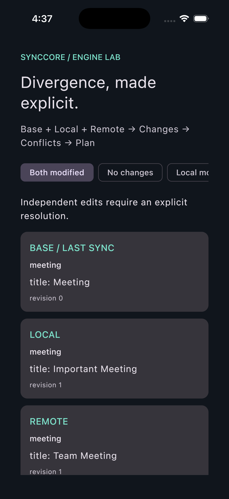

# SyncCore

**Make offline replica divergence explicit before either branch is overwritten.**

When two replicas change independently, choosing the newest-looking revision can silently discard a valid edit. SyncCore compares local and remote snapshots with their last accepted base, identifies additions, modifications, deletions and conflicts, then produces an inspectable plan with explicit resolution choices.

The engine applies that plan to detached in-memory states after checking for stale inputs and recomputing the canonical plan. An Android/iOS lab exposes the inputs, conflicts, operations and resulting baseline so synchronization decisions can be examined and replayed.

## A conflict you can inspect

For one identity, Base contains **Meeting**, Local contains **Important Meeting**, and Remote contains **Team Meeting**. The default preserves both divergent branches as an unresolved conflict. `KEEP_BOTH` creates distinct stable identities and converges both replicas to both values.

```kotlin
val scenario = DemoScenarios.all.first()
val unresolved = SyncSimulator().run(scenario)
val resolved = SyncSimulator().run(
    scenario, ResolutionChoices(ResolutionPolicy.KEEP_BOTH)
)
```

Imports come from `com.noise.synccore.simulator` and `com.noise.synccore.domain.policy`.

<p align="center">
  
</p>

*Existing iOS simulator capture of divergent inputs. The lab contains 15 scenarios and per-conflict choices; this image is a smoke-check capture, not exhaustive UI validation.*

## Planning and applying are separate decisions

```text
Base + Local + Remote
    → three-way changes → field/entity/delete-modify conflicts
    → explicit whole-entity policy → ordered operations with preconditions
    → stale-input check + canonical replan
    → detached replica results + baseline for converged identities
```

`KEEP_LOCAL`, `KEEP_REMOTE`, `KEEP_BOTH` and `SKIP` can be selected globally or per conflict. Field differences are exposed, but resolution remains whole-entity selection rather than automatic text/field merging. Delete/modify conflicts require the same explicit decision as competing edits.

The executor rejects changed inputs and plans that differ from canonical engine output before returning results. Baselines advance only for converged identities; skipped conflicts retain their earlier base. Native baseline repositories use compare-and-set publication within the process. See [planner](shared/src/commonMain/kotlin/com/noise/synccore/engine/SyncPlanner.kt), [executor](shared/src/commonMain/kotlin/com/noise/synccore/engine/PlanExecutor.kt), [safety](docs/safety.md) and [resolution policies](docs/resolution-policies.md).

## Measured cost of the guards

The existing JVM report includes two warmups and five timed samples per stage, excluding fixture generation:

| Identities | Conflicts / operations | Full planning median | Guarded application median |
|---:|---:|---:|---:|
| 10,000 | 2,000 / 8,000 | 16.60 ms | 31.81 ms |
| 100,000 | 20,000 / 80,000 | 149.75 ms | 347.19 ms |

These are rounded values from the [measured report](docs/benchmark-report.md), on Temurin 21.0.8, macOS 26.4.1 ARM64, with 10 available processors. Planning includes detection and resolution; application includes canonical replanning. This makes the extra integrity cost visible instead of hiding it in a claim of “fast sync.”

These in-process samples are subject to warmup, GC and system load; five-sample empirical p95 equals the maximum. They do not establish mobile throughput, network sync performance or peak memory. [Methodology](docs/performance.md) and [raw samples](docs/benchmark-samples.csv) support reproduction.

## Shared decisions, platform hosts

`shared/commonMain` contains the pure engine, simulator, JSON replay codec, repository interfaces and Compose lab. Android/iOS adapters supply baseline storage and host entry points. Domain decisions do not depend on network, current time or random values, enabling deterministic replay across platforms. See [architecture](docs/architecture.md), [KMP boundaries](docs/kmp.md) and [decisions](docs/decisions/).

## Run and check

```sh
./gradlew :androidApp:assembleDebug
./gradlew :shared:testAndroidHostTest
./gradlew :shared:benchmarkSyncCore
./gradlew :shared:iosSimulatorArm64Test :shared:linkDebugFrameworkIosArm64
./gradlew :shared:connectedAndroidDeviceTest
```

The last command requires an Android device. Open `iosApp/iosApp.xcodeproj` for the iOS host. In the lab, choose a conflict, compare policies, inspect operations and results, then replay.

The existing [evaluation record](docs/evaluation.md) reports 35 host, 35 iOS simulator and 34 Android device tests passing, plus 395 deterministic scenario/policy combinations. Tests cover stale/tampered plans, collisions, deletion conflicts, replay, codecs and baseline publication. Those are historical verification results, not checks rerun during this README revision.

## Where the guarantees end

SyncCore is an in-memory engine and conflict lab. Real transport/filesystem transactions, retry protocols, tombstones, multi-peer causality, rename inference, text merge and authentication remain outside scope. Detached atomic application does not make writes to a server atomic. Revisions do not establish cross-branch authority; baseline adapters do not promise cross-process or crash-durable publication.

Physical iOS deployment and compatibility with the configured minimum OS remain unverified; the recorded simulator run used iOS 26.5. JSON is a bounded local replay format, not a streaming transport protocol. See [serialization](docs/serialization.md) and [evaluation limitations](docs/evaluation.md).
