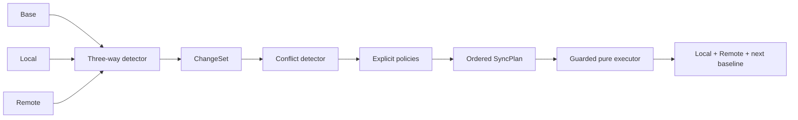

# Synchronization model

A `SyncInputs` triple holds the last accepted base and independently evolved local/remote snapshots. A `SyncState` is a sorted map of stable identities to exact string field maps and logical revisions. Constructors detach caller collections, reject duplicate IDs, blank identity/field names and negative revisions. Identity and values are never trimmed or case-folded; normalization changes ordering only.

Absence is deletion only if the identity existed in the base. Tombstones, causality vectors, transport acknowledgements and multi-peer history are outside scope. Without a retained base, the engine cannot infer whether an absent item was never created or deleted before synchronization.

The planner includes unchanged IDs in `completedIds` so agreed snapshots become the accepted baseline even without mutations. Execution updates baseline entries only for converged IDs, preserving the old base for unresolved IDs. A result is complete only when it has no unresolved conflicts and both replicas are equal. A second sync using a completed result and its baseline produces no operations.

Plans operate on whole entities. An update replaces a full snapshot, including field removals and revisions. Each mutation contains a side, identity, expected old entity (null for creation) and replacement (null for deletion). Conflict/skip markers have no storage side and cannot mutate data.
